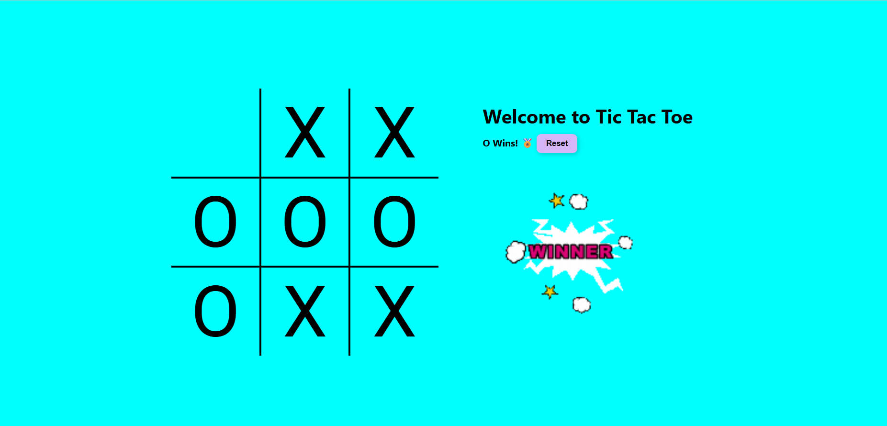

# 🎮 Tic-Tac-Toe Game

A simple web-based Tic-Tac-Toe game built using **HTML**, **CSS**, and **JavaScript**.

## 🖼️ Demo




## 🚀 Features

- Player vs Player gameplay
- Animated hover effects
- Clear win/draw messages
- Reset game button
- Fully responsive design (mobile-friendly)

## 🛠️ Tech Stack

- HTML5
- CSS3
- JavaScript (ES6)

## 📁 Project Structure
tic-tac-toe/

├── index.html

├── style.css

├── script.js

├── music.mp3

├── ting.mp3

├── gameover.mp3

└── README.md


## 💡 How to Use

1. **Clone the repository**
   ```bash
   git clone https://github.com/your-username/tic-tac-toe.git
   cd tic-tac-toe

